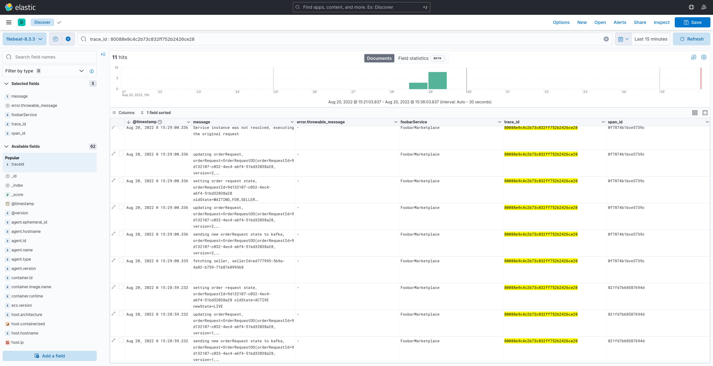
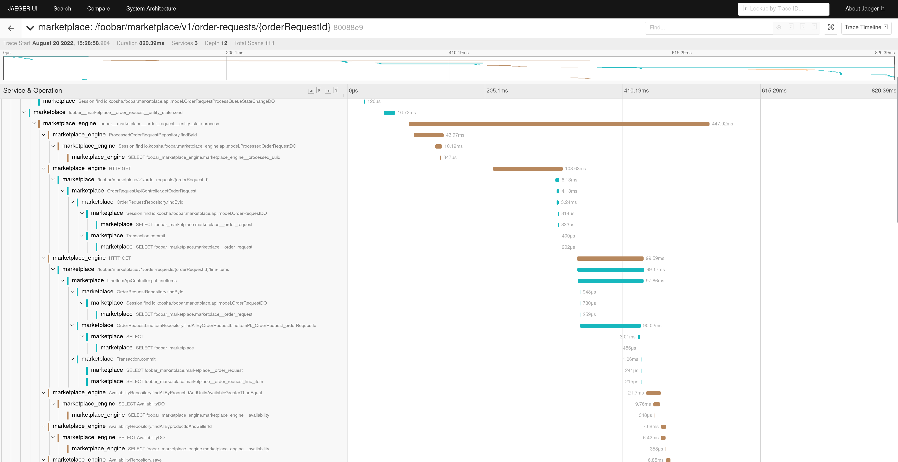
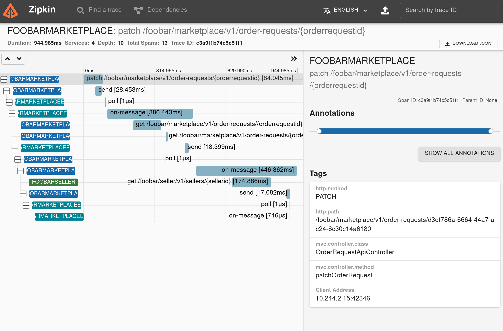
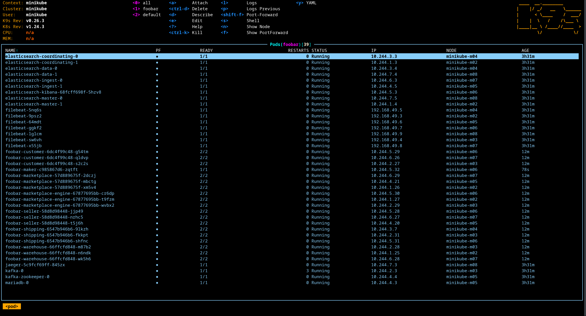
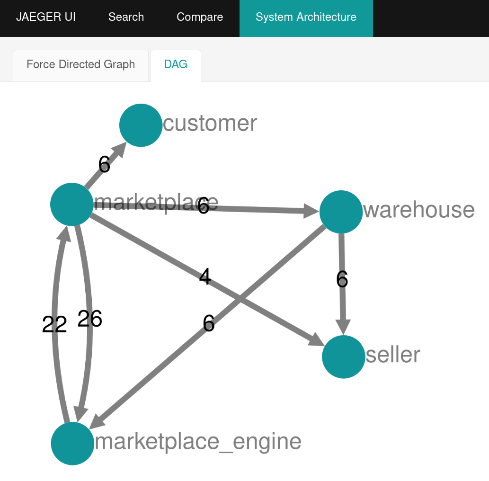
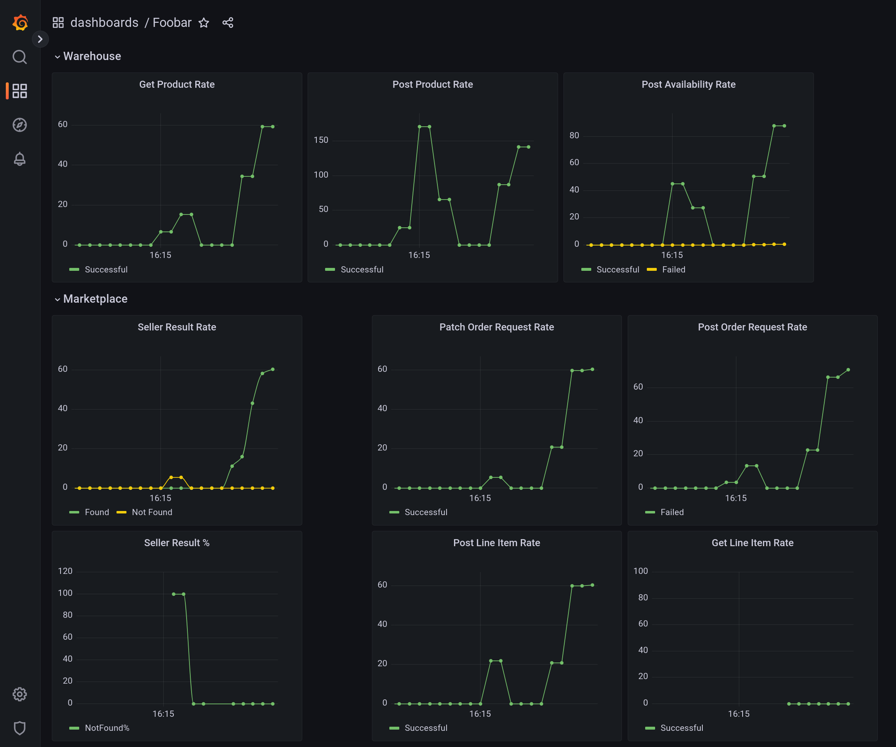
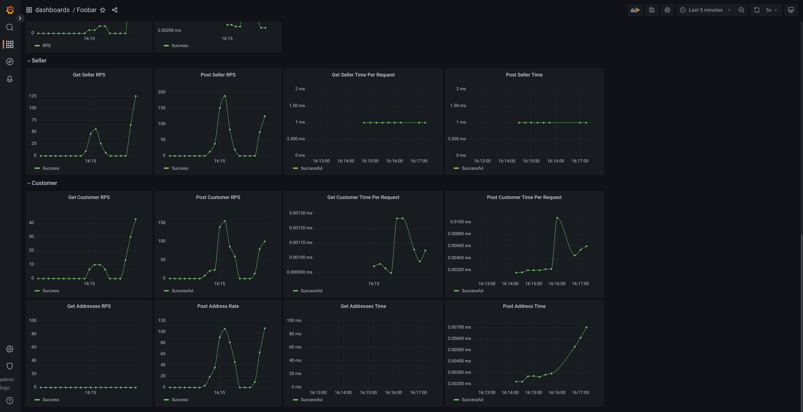

## Foobar

Spring Boot 2 example microservices.

Foobar is a fictional marketplace. Its purpose is demonstration of
microservices, distributed tracing, monitoring, and ... using Spring Boot.

### (Some of the) technologies used in the stack:

- Spring Boot: While there are more shiny / exciting frameworks for java, I felt
  using the de facto framework, allows one to focus on the subject
  of microservices rather than frameworks.

- Kafka: is the broker that some of Foobar microservices communicate through.

- Open API (Swagger): to document the HTTP endpoints and automatically generate
  Feign clients and reactive clients (WebClient) for them.<br>
  In order to add circuit breaker and retry capability to the generated clients
  more easily, a custom openapi-generator ( foobar-gen) is used.

- Feign: is the HTTP client that the microservices use to communicate with each
  other. The underlying deserializer is Jackson and the transport library is
  OkHTTP. Feign clients are generated using open API generator.

- ELK stack: to collect logs. elasticsearch and Kibana are there, but the L in
  ELK is replaced by filebeat, which directly sends the logs to elasticsearch.
  With ELK, also comes structured logging. So the application _can_ log in json
  format too. On local deployments it is not enabled by default. On k8s, json
  logs are appended to a file, a second container in the pod dumps it to stdout
  and finally filebeat DaemonSet scraps it and sends to elasticsearch. This way
  normal readable logs are available too alongside machine readable json logs.


- Jaeger: collects tracing data. Runs as a JVM agent.

- Zipkin: alternative to Jaeger. Spring Sleuth is used to communicate with a
  zipkin server.

- Spring Webflux / Project reactor: one of the subprojects (foobar-marketplace),
  is reactive and uses Spring Webflux. For the sake of simplicity other
  subprojects of foobar are blocking.

- R2dbc: it replaces Hibernate in the reactive subproject.

- Flyway: for DB migration. Currently used only in the reactive subproject.

- Kubernetes: it's possible to deploy all the services to kubernetes. The way
  services are wired together are not currently the best way or even the right
  way to deploy to k8s, it's work in progress.<br>
  Even though k8s is a possibility, it's completely ok to run all the services
  locally on a single host. In fact, the development approach is host first, k8s
  next.

- Kotlin: While possible to use a distinct language for each microservice, one
  of possibilities unlocked by microservices, Foobar uses only kotlin, so the
  user can focus on the application of microservices pattern rather than dealing
  with how to compile, build and run projects in zillion different languages.

- Make: anything you want to do there's a make command for it :)

- Gradle: is the build system.

### Subprojects and directory structure

Foobar consists of some subprojects:

- buildSrc: shared gradle data between all subprojects. Mostly keeps dependency
  versions in sync.
- connect: the auto-generated Feign clients, uses foobar-gen as generator.
- foobar-gen: the open-api Feign generator. It's the modified version of the
  original Java generator.
- foobar-evil: connects to services and tells them to behave badly. Somehow like
  Chaos Monkey by Netflix. It's WIP.
- foobar-maker: a CLI application that interacts with other services. It's used
  to easily interact with HTTP endpoints: create customers, order requests,
  line-items, modify these entities and ...<br>
  There's also a Make framework (`make customer` calls the rest endpoint and
  creates a customer entity), but it's disabled by default. You can enable it
  by uncommenting `legacy_maker` in the Makefile.

And the microservices in the service directory:

- service/customer: a microservice, holding customer information. No
  dependency on other services.
- service/seller: a microservice, holding seller information. No
  dependency on other services.
- service/warehouse: a microservice, holding product information and their
  availability in the market. Has a dependency on seller microservice to make
  sure a seller exists and is in valid state when adding a product availability.
- service/marketplace: order requests are sent to this microservice. Has
  dependency on customer, seller and warehouse microservices.
- service/marketplace\_engine: receives order requests from marketplace through
  kafka, processes them and sends back the result through kafka again (to
  marketplace).
  Also receives availability of products through kafka (produced by warehouse).
- service/shipping: holds shipping information. Once a seller is found for an
  order request, shipping service creates a shipping entry for that order.

### A note on k8s practices:

This project is far from using k8s best practices. Even the most basic rules are
broken: pg password is hardcoded in plain text rather than using k8s
secrets.
However, it's a welcoming change to make Foobar k8s compliant, it should not
make things more complicated. For instance if using secrets to store randomly
generated passwords for pg, it must still be as easy as running a single
make command to spawn a pg cli.

### A note on microservices practices:

Since it's a fictional marketplace, it doesn't necessarily have the best
segregation of responsibilities among services. For instance, maybe it was
better to keep marketplace and marketplace_engine in a same service?<br>
Anyway, let's imagine there's a fictional company FizzBuzz with team structure
such as the one assumed in Foobar, so it made sense for them to have this
structure.

### Roadmap

- Add service discovery.
- Add tests for all services.
- Address the [TODO.md](./assets/TODO.md).
- Demonstrate Saga pattern.
- Demonstrate event sourcing (only in one of microservices).
- Add helm charts for foobar services.
- Complete foobar-evil to make disruptions in the services.

### Up and Running: Locally

Use the following sequence of commands to run dependency services and then run
all foobar microservices locally on host:

```bash
# Build the services dependencies and the services themselves. 
make clean \
  libs/opentelemetry-javaagent-1.32.0.jar \
  build-proto \
  build
  
# Run the services foobar depends on.
make local-run-dependencies

# If this fails, you might need to adjust your pg credentials.
make local-init-create-db

# Create and configure kafka topics. Kafka should be running by now, by the
# local-run-dependencies command above.
make local-init-create-topics

# Run foobar services.
make run-customer
make run-seller
make run-warehouse
make run-marketplace
make run-marketplace-engine
make run-shipping

# Generate some load
./maker.sh init && ./maker.sh ord patch --state=LIVE
# OR
./maker.sh init --live

# If you want to put everything under pressure:
./loader.sh
```

### Up and Running: Kubernetes

**IMPORTANT!!** seriously consider defining the 
`FOOBAR_FAST_DOCKER_REGISTRY=true` environment variable, it will make minikube
read images from a local docker container running a docker registry, rather than
than pushing images to minikube internal docker registry. It's way faster! but
requires opening port 5000 on your local host's firewall.

Use the following sequence of commands to spawn a minikube cluster and deploy
all foobar microservices to it:

```bash
# And then wait until all nodes are up.
# Important: adjust number of nodes and memory in Makefile beforehand!
# Default values could be too generous.
make minikube-start

# Create the foobar namespace.
make k8s-namespace

# Not necessary for make to work, it specifies namespace explicitly on every
# command. But makes life in cli easier.
make kubectl-set-ns

# Deploy supporting services: kafka, pg, elasticsearch, ...
# Important: please wait until all pods are running before running next
# commands.
make helm-add-repos
make k8s-deploy-deps

# Create the empty pg databases. They'll be initialized on services startup
# by Hibernate.
make k8s-init-create-db

# Create kafka topics with proper partitioning configuration.
make k8s-init-create-topics

# Build the services dependencies and the services themselves
make clean \
  libs/opentelemetry-javaagent-1.17.0.jar \
  build-proto \
  build

# Push to minikube and run on k8s.
make docker-image
make k8s-deploy 

# Monitor: do port forwarding and check the dashboards.
k8s-port-forward-kibana
k8s-port-forward-jaeger-ui
k8s-port-forward-zipkin

# Generate some load.
make k8s-exec-maker-cli
# and in the shell you get, type:
# "maker init && maker ord patch --state=LIVE"
# OR
# "maker init --live"

# If you want to put everything under pressure:
FOOBAR_REPLICAS=4 make k8s-deploy-loader
```

## Foobar Workflow:

Here's how an order is processed through Foobar marketplace

1. Customer and Address entities:
    - Customers created through foobar-customer:<br>
      POST http://{foobar-customer-service}/customers/
    - Shipping addresses for customers are added through foobar-customer:<br>
      POST http://{foobar-customer-service}/customers/{CUSTOMER-UUID}/addresses
    - These two operations have no external dependency.
    - Customers are entities who put requests in market, to buy a list of
      products.
2. Seller entity:
    - Sellers created through foobar-customer:<br>
      POST http://{foobar-seller-service}/sellers/
    - This operation has no external dependency.
    - Sellers are entities who announce that have some products available and
      in what quantity.
3. Product and Availability entities:
    - Product created through foobar-warehouse, this operation has no external
      dependency:<br>
      POST http://{foobar-warehouse-service}/products/
    - Availability of product: sellers announce that they have a product
      available in their warehouse. They announce through the following
      endpoint. This operation has two dependency: 1. Seller, to make sure
      sellerId is valid, and kafka, to announce availability of product to other
      services.<br>
      POST http://{foobar-warehouse-service}/products/{PRODUCT-UID}/availabilities
4. Order Request and Line Items:
    - A customer creates order requests, which is container for a list of items
      using the same service, customers add line items to the order request they
      created.<br>
      POST http://{foobar-marketplace-service}/order-requests/
    - Line Items are added to Order Request through the following endpoint:<br>
      POST http://{foobar-marketplace-service}/order-requests/{ORDER-REQ-UUID}/line-items
    - The customer finally marks the OrderRequest for going live, so that
      sellers can compete, later the winning seller is assigned to order
      request. To mark an OrderRequest ready for sellers (status=live) the
      following endpoint is used:<br>
      PATCH http://{foobar-marketplace-service}/order-requests/{ORDER-REQ-UUID}
    - These operations all depend on foobar-customer, so that foobar-marketplace
      can query the customer database and make sure customer is "active" and
      allowed to make orders.
5. Order Request is sent from foobar-marketplace to foobar-marketplace-engine,
   so that the engine can find a seller for OrderRequest.
   This operation depends on kafka.
6. Marketplace-Engine:
    - Reads product availabilities through kafka (from foobar-warehouse).
    - Reads OrderRequest through kafka (from foobar-marketplace).
    - Finds a seller for OrderRequest, and reduces availability of that product
      from that seller.
    - It announces the seller it has found and new state
      of OrderRequest (state=SellerFound) through kafka.
7. Shipping service listens through kafka to state change of OrderRequest. Once
   a seller is found, it ships the products to customer's address and marks the
   OrderRequest as fulfilled.

### Some Screenshots

<br>
elasticsearch:
<br>



<br>
Jaeger:
<br>



<br>
Zipkin:
<br>



<br>
Kubernetes:
<br>



<br>
Microservices architecture:
<br>



<br>
Grafana
<br>


<br>

